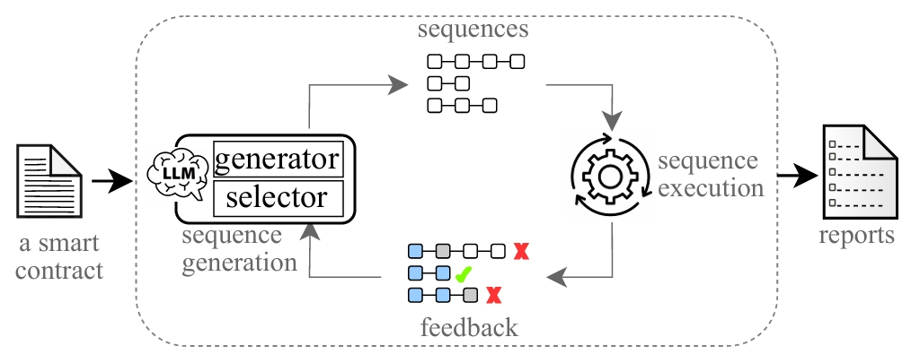

##  Gensel ##

Gensel is a feedback-driven LLM-enabled symbolic execution framework for Solidity smart contracts. It features an iterative process of sequence generation and sequence execution. The LLM-based sequence generation involves two roles to speed up LLMs to generate coverage-improving sequences.




[Experiment Data and Scripts](https://github.com/zqp542375/gensel_exp_scripts_and_data)


<hr>

###  Run Gensel through Docker: 

1, Pull the Docker image of Gensel:
```bash
$ sudo docker pull 23278942/gensel
```

2, Run Gensel with a single Docker command. Replace a_host_directory with the path to your host directory containing the Solidity file, for example, Crowdsale.sol.
```bash
$ sudo docker run -it --rm -v a_host_directory:/home/gensel/ --entrypoint semyth 3278942/gensel ./Crowdsale.sol:Crowdsale
```
This command mounts the host directory to a directory inside the container and analyzes the contract Crowdsale defined in the Solidity file Crowdsale.sol.


Click [here](./example_output/Crowdsale.sol_terminal_output_llm_based.txt) to see the terminal output.


### Install solc-select and all versions of solc
```
pip install solc-select  # solc-select is a package to switch among different versions of solc (Solidity compiler)
solc-select install all  # install all possible versions of solc 
solc-select use 0.4.25   # example of using solc-select: set the version of solc to 0.4.25
```


### Run Gensel in Pycharm IDE:

1, Create a project through Pycharm IDE by cloning https://github.com/zqp542375/gensel.git

2, Create a virtual environment and install dependencies.

3, Find semyth.py in the root directory and add the parameters. Take the example of Crowdsale.sol:
```
analyze
./tests/testdata/solidity_files/Crowdsale.sol:Crowdsale --llm-model llama 
```
4, Run semyth.py by right clicking it and select "Run semyth".

or run Gensel in the terminal of Pycharm IDE:

```bash
$ python semyth analyze <solidity-file>:<contract-name> --llm-model llama
```
Replace <solidity-file> with the path to your Solidity file and <contract-name> with the name of the contract you want to analyze. 


